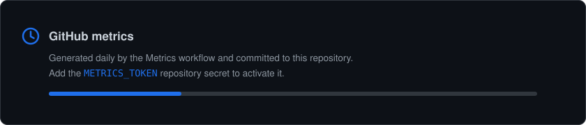

<picture>
  <source media="(prefers-color-scheme: dark)" srcset="https://readme-typing-svg.demolab.com?font=Fira+Code&weight=500&size=26&duration=2800&pause=900&color=1F6FEB&center=true&vCenter=true&width=560&height=46&lines=Emre+Mente%C5%9Fe;Software+Engineer;Back-End+%26+Distributed+Systems">
  <source media="(prefers-color-scheme: light)" srcset="https://readme-typing-svg.demolab.com?font=Fira+Code&weight=500&size=26&duration=2800&pause=900&color=0969DA&center=true&vCenter=true&width=560&height=46&lines=Emre+Mente%C5%9Fe;Software+Engineer;Back-End+%26+Distributed+Systems">
  
</picture>

---

## About

Software Engineer with an Electrical & Electronics Engineering background, based in **Istanbul, Turkey** — Istanbul Medeniyet University.

I build back-end services and distributed systems: Python and Go APIs, event-driven pipelines, time-series storage, and the observability around them.

I have worked extensively with platform APIs. If you hit obstacles integrating **Instagram, Facebook, WhatsApp** or similar products, I can provide remote support to your organisation at both the business and development stages.

---

## Tech Stack

<b>Back-End</b>

 
<picture>
  <source media="(prefers-color-scheme: dark)" srcset="https://skillicons.dev/icons?i=go,py,django,fastapi,postgres,mongodb,sqlite,redis,nginx,rabbitmq&theme=dark&perline=10">
  <source media="(prefers-color-scheme: light)" srcset="https://skillicons.dev/icons?i=go,py,django,fastapi,postgres,mongodb,sqlite,redis,nginx,rabbitmq&theme=light&perline=10">
  
</picture>
 

<b>Front-End</b>

 
<picture>
  <source media="(prefers-color-scheme: dark)" srcset="https://skillicons.dev/icons?i=react,ts,js,html,css,bootstrap,jquery&theme=dark&perline=10">
  <source media="(prefers-color-scheme: light)" srcset="https://skillicons.dev/icons?i=react,ts,js,html,css,bootstrap,jquery&theme=light&perline=10">
  
</picture>

<b>DevOps</b>

 
<picture>
  <source media="(prefers-color-scheme: dark)" srcset="https://skillicons.dev/icons?i=docker,githubactions,bash,prometheus,grafana,linux,ubuntu,apple&theme=dark&perline=10">
  <source media="(prefers-color-scheme: light)" srcset="https://skillicons.dev/icons?i=docker,githubactions,bash,prometheus,grafana,linux,ubuntu,apple&theme=light&perline=10">
  
</picture>
 

<b>Tools</b>

 
<picture>
  <source media="(prefers-color-scheme: dark)" srcset="https://skillicons.dev/icons?i=git,github,vscode,androidstudio,postman,figma,notion&theme=dark&perline=10">
  <source media="(prefers-color-scheme: light)" srcset="https://skillicons.dev/icons?i=git,github,vscode,androidstudio,postman,figma,notion&theme=light&perline=10">
  
</picture>
 

<b>Integrations &amp; Cloud</b>

 
<picture>
  <source media="(prefers-color-scheme: dark)" srcset="https://skillicons.dev/icons?i=aws,cloudflare,firebase,discord,gmail,twitter&theme=dark&perline=10">
  <source media="(prefers-color-scheme: light)" srcset="https://skillicons.dev/icons?i=aws,cloudflare,firebase,discord,gmail,twitter&theme=light&perline=10">
  
</picture>
 

---

## Statistics

<picture>
  <source media="(prefers-color-scheme: dark)" srcset="./assets/metrics-dark.svg">
  <source media="(prefers-color-scheme: light)" srcset="./assets/metrics-light.svg">
  
</picture>

<picture>
  <source media="(prefers-color-scheme: dark)" srcset="https://streak-stats.demolab.com?user=emrementese&theme=github-dark-blue&hide_border=true&border_radius=10&date_format=j%20M%5B%20Y%5D&card_width=460">
  <source media="(prefers-color-scheme: light)" srcset="https://streak-stats.demolab.com?user=emrementese&theme=default&hide_border=true&border_radius=10&date_format=j%20M%5B%20Y%5D&card_width=460">
  
</picture>

<picture>
  <source media="(prefers-color-scheme: dark)" srcset="https://github-profile-summary-cards.vercel.app/api/cards/productive-time?username=emrementese&theme=github_dark&utcOffset=3">
  <source media="(prefers-color-scheme: light)" srcset="https://github-profile-summary-cards.vercel.app/api/cards/productive-time?username=emrementese&theme=github_light&utcOffset=3">
  
</picture>

  

